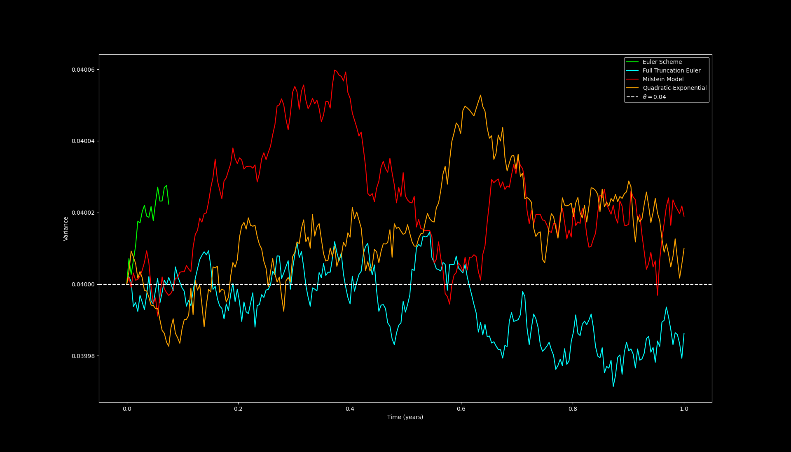

# 6 Heston SDEs

The Heston equation is just another model that accounts for stochastic volatility

The equation of the asset is:
$$dS_t = rS_t dt + \sqrt{v_t}S_t  dW_t^{(1)} a$$

where $v_t$ is the variance of the asset's price (volatility squared $v_t = \sigma^2$)

The equation of the variance throughout time is:
$$dv_t = \kappa(\theta - v_t)dt + \xi\sqrt{v_t}dW_t^{(2)} a$$

Where $\kappa$ is the mean-reversion speed of the variance, $\theta$ is the long run variance, $\xi$ is the volatility of variance

Both of the Brownian motions $W_t^{(1)}$ and $W_t^{(2)}$ are both correlation with a correlation factor $\rho$ . The equation to show this is:

$$dW_t^{(1)} dW_t^{(2)} = \rho dt$$

These equations are what is going to be used in order to price the options, using a Monte Carlo simulation.

A problem with a lot of these models is the fact that the variance can hit 0. The **Feller Condition** tell us whether the fluctuations in variance are strong enough compared to the mean reversion such that it does not hit 0. 

$$2\kappa\theta \geq \xi^2$$

## 6.1 Heston with the Euler-Maruyama Discretisation

The Euler-Maruyama discretisation says that for a stochastic differential equation in the form of:
$$dX_t = a(X_t, t)dt + b(X_t, t)dW_t$$

That the solution of $X$ is the Markov chain $Y$ which is defined like this:
$$Y_{t+1} = Y_t + a(Y_t, t_n)\Delta t + b(Y_n, t_n)\Delta W_n$$

where $\Delta W_n = W_{n+1} - W_n$ 

For the Heston SDE the EM-Discretisation can be used like this:
$$S_{t+1} = S_t + rS_t \Delta t + \sqrt{v_t} S_t \sqrt{\Delta t}Z_1$$
and 
$$v_{t+1} = v_t + \kappa(\theta - v_t)\Delta t + \xi\sqrt{v_t}\sqrt{\Delta t}Z_2$$
where $Z_1 , Z_3 \sim \mathcal{N}(0,1)$ and $Z_2  = \rho Z_1 +  \sqrt{1-\rho^2}Z_3$

In the Source code have two Wiener functions $W_1$ and $W_3$ which I use to generate $Z_1$ and $Z_3$ and then from there use that to generate $Z_2$ to compute both equations for a grid spacing of $\Delta t = T / N$ for $M$ times. 

Finally after that I used ```std::transform```  to give the option price from the terminal asset value.

The time complexity of all the Monte Carlo simulations in this section is $\boxed{\mathcal{O}(MN)}$ 

The problem currently is that the variance $v_t$ can be negative which is what I am going to fix with the next one.

## 6.2 Heston with Full Truncation Error

The way we can fix this in order not to get negative variance is by taking $\max{(v_t, 0)}$ at each iteration of $S_t$ and $v_t$ or basically:
$$S_{t+1} = S_t + rS_t \Delta t + \sqrt{\max(v_t, 0)} S_t \sqrt{\Delta t}Z_1$$
and 
$$v_{t+1} = \max(v_t, 0) + \kappa(\theta - \max(v_t, 0))\Delta t + \xi\sqrt{\max(v_t, 0)}\sqrt{\Delta t}Z_2$$
the remaining structure from 6.1 still applies.

## 6.3 Heston with the Simplified Milstein's Model

The simplied Milstein's model adds more correction terms to each equation of $S_t$ and $v_t$ specifically targeting the existing diffusion effect that EM has.

The full equations are:
$$S_{t+1} = S_t + rS_t \Delta t + \sqrt{\max(v_t, 0)} S_t \sqrt{\Delta t}Z_1 + \frac{1}{2}S_t \max(v_t,0)\Delta t (Z_1^2 - 1)$$
and 
$$v_{t+1} = \max(v_t, 0) + \kappa(\theta - \max(v_t, 0))\Delta t + \xi\sqrt{\max(v_t, 0)}\sqrt{\Delta t}Z_2 + \frac{1}{4}\xi \delta ^2 (Z_2^2 - 1)$$
the remaining structure from 6.1 and 6.2 still applies.

## 6.4 Heston with Andersen's Quadratic-Exponential Scheme

This model completely destroys the negative variances that the other Heston models might have had.

The Scheme starts like this:

1. Define $X_t = ln(S_t)$  
2. Calculate $s^2$  using the equation
$$s^2 = \frac{v_t  \xi ^  2 \exp(-\kappa \Delta t) (1 - \exp(-\kappa \Delta t)}{\kappa} + \frac{\theta (\xi -\xi\exp(-\kappa \Delta t))^2}{2\kappa}$$
3. Calculate  $m$ using the equation
$$m = \theta +(v_t - \theta)\exp(-\kappa \Delta t)$$
4. Calculate $\phi$ with the equation
$$\phi = \frac{s^2}{m}$$
5. If $\phi < \phi_c$ start with Step 6, if $\phi \geq \phi_c$ start with Step 9. The most common choice for tolerance is $\phi_c= 1.5$
6.  Calculate $b^2$ with the equation
$$b^2 = \frac{2}{\phi} -1 + \sqrt{(\frac{2}{\phi})(\frac{2}{\phi} -1})$$
7. Calculate $a$ with the equation
$$a = \frac{m}{1 + b^2}$$
8. Calculate $v_{t+1}$ with the equation below and then skip to Step 14
$$v_{t+1} = a (b + Z_1)^2 $$
9. Calculate $p$ with the equation
$$p = \frac{\phi - 1}{\phi + 1}$$
10. Calculate $\beta$ with the equation
$$\beta = \frac{1-p}{m}$$
11. Find the value of $U$ using the uniform distribution on $U \sim \mathcal{U}(0,1)$ 
12. If $u \leq p$ then set the variance $v_{t+1} = 0$
13. If $u > p$ then set the  variance $v_{t+1}$ using the equation
$$v_{t+1} = -\frac{\log(\frac{1-p}{1-u})}{\beta}$$

14. Calculate $X_{t+1}$ using the equation:
$$X_{t+1} = X_t + r\Delta t + K_0 + K_1 v_t + K_2 v_{t+1} + \sqrt{K_3 
v_t + K_4 v_{t+1}} Z_2$$
where:
$$K_0 = \frac{-\rho \kappa \theta \delta t}{\xi}$$

$$K_1 = \gamma_1 \Delta t (\frac{\kappa \rho}{\xi} - 0.5) - \frac{\rho}{\xi}$$
$$K_2 = \gamma_2 \Delta t (\frac{\kappa \rho}{\xi} - 0.5) + \frac{\rho}{\xi}$$
$$K_3 = \gamma_1 \Delta t (1 - \rho^2)$$
$$K_4 = \gamma_2 \Delta t (1 - \rho^2)$$
where $\gamma_1, \gamma_2$ are weighting parameters which satisfy $\gamma_1 + \gamma_2 = 1$ and the most common choice for these are $\gamma_1 = \gamma_2 = \frac{1}{2}$ 

15. Calculate $S_t$ using $S_t = \exp(X_t)$
16. Calculate the option prices like done from 6.1 - 6.3

## Volatility Comparison

As you can see, the volatility of the Euler scheme becomes NaN pretty early (since $\sqrt{-x}$ doesn't exist), while the others continue since they make sure negative variances cannot exist. All of them stay around the same long run volatility of $\theta = 0.4$

The other parameters used for this graph are:
$\rho = -0.7$, $\kappa = 0.2$, $\xi = 0.3$, $N = 252$ and $M = 1,000,000$
Which does satisfy the Feller condition 

